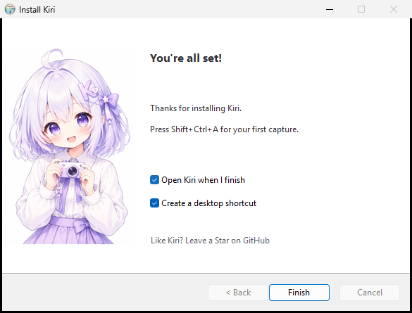

# Desktop Installer

[简体中文](README_ZH.md)

A shared, character-led Windows installer theme for **Tauri 2 + NSIS**.
Maintain the layout, translations, and artwork in one repository. Give each app
its own half-body mascot, welcome message, and optional GitHub link.

<table><tr>
<td align="center"><br>Kiri</td>
<td align="center"><br>Mimi</td>
<td align="center"><br>Satori</td>
<td align="center"><br>Viva</td>
<td align="center"><br>Tick</td>
<td align="center"><br>WNACG</td>
</tr></table>

The images above are the actual sidebar assets. The preview and native installer
share layout coordinates; Windows supplies the controls, fonts, and DPI scaling.



*Actual Windows CI capture of the native English finish page. The UI fixture installs no application.
[All 54 captures and the interactive gallery](https://github.com/yuxino/desktop-installer/actions/runs/34704671886) are available in the run artifact.*

- Distinct high-resolution character masters; lossless 656 × 1256, 24-bit sidebars
  filtered to the actual native control size for smooth edges.
- English, Simplified Chinese, and Japanese, including Tauri maintenance/error dialogs.
- Native welcome and finish pages with an optional, click-only GitHub/Star link.
- Pinned, hash-checked offline bundles. Application builds need only Node.js.
- One command updates every registered app. No hand-maintained template copies.
- Tauri continues to own installation, updates, uninstall, shortcuts, and WebView2.

## Try it

Requires Node.js 22 or newer. No npm dependencies or image-service credentials.

```sh
git clone https://github.com/yuxino/desktop-installer.git
cd desktop-installer
npm test
npm run build
npm run preview
```

Open `dist/preview.html` to switch between products, languages, and welcome/finish
pages. This is a layout preview, not a Windows screenshot.

With NSIS 3.11 on PATH, `npm run test:nsis` compiles a harmless preview executable
for each product/language. These previews install and launch no application.
Windows CI also opens all 18 native previews, checks Next/Back/Finish and the Run
checkbox, and captures the welcome, directory, and finish pages. Download the
`installer-previews-and-bundles` Actions artifact and open `windows-ui/` for PNGs,
`index.html`, control bounds/text, and `results.json` (including actual DPI and executable hashes).
The screenshots come from Windows, while the fixtures do not install app payloads;
application installation, upgrades, and real-device DPI acceptance remain separate.

## Use it in your app

Fork or clone the repository, add your profile and artwork, then sync a pinned
bundle into your Tauri project:

```sh
node scripts/sync.mjs --project ../my-app --product my-app
```

The [integration guide](docs/integration.md) covers profiles, artwork, an existing
custom installer, build commands, and updating the bundle. It works with your
own app name, publisher, and GitHub repository; the six included profiles are examples.

For all registered apps under one parent directory:

```sh
npm run sync -- --root ../
npm run sync -- --root ../ --check
```

Review and commit generated bundles in the application repositories. Updating
this source does not silently change existing releases or consumers: run sync
and build the next application version when you are ready.

## Scope

This project styles Windows NSIS installers. It does not issue signing
certificates, remove OS security prompts, implement download progress inside
your app, or replace its updater. macOS DMG/PKG styling is not included.
See the [architecture decision](docs/architecture.md) for these boundaries.

## Contributing and license

See [CONTRIBUTING.md](CONTRIBUTING.md). Code, templates, and included illustrations
are available under the [MIT license](LICENSE). Character illustrations are
AI-generated using each project's existing mascot as reference; generation
records are in [docs/artwork.md](docs/artwork.md).
Product names identify their respective projects; using this toolkit does not
imply endorsement by those projects.
