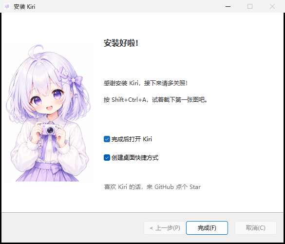

# Desktop Installer

适用于 **Tauri 2 + NSIS** 的 Windows 安装界面主题，统一维护布局、文案和角色素材。
内置 Kiri、Mimi、Viva、Tick 四套配置，支持英语、简体中文、繁体中文、日语、德语、韩语和法语。



*Windows 原生预览截图，预览程序不会安装应用。*

## 本地预览

需要 Node.js 22 或更新版本，无需安装 npm 依赖。

```sh
git clone https://github.com/yuxino/desktop-installer.git
cd desktop-installer
npm run build
npm run preview
```

打开 `dist/preview.html` 查看布局预览，可切换应用、语言和页面。原生预览编译需要 NSIS 3.11：

```sh
npm run test:nsis
```

## 接入应用

按[接入说明](docs/integration.md)添加产品配置和素材，再同步到 Tauri 项目：

```sh
node scripts/sync.mjs --project ../my-app --product my-app
```

同步所有已登记应用：

```sh
npm run sync -- --root ../
```

提交应用仓库中的生成文件并重新构建应用，已有安装包不会随本仓库更新。
安装、更新和卸载仍由 Tauri 负责。

## 文档与许可

[设计说明](docs/architecture.md) · [素材来源](docs/artwork.md) · [贡献指南](CONTRIBUTING.md)

代码、模板和角色素材采用 [MIT 许可](LICENSE)。角色素材由 AI 参考各应用已有形象生成。
