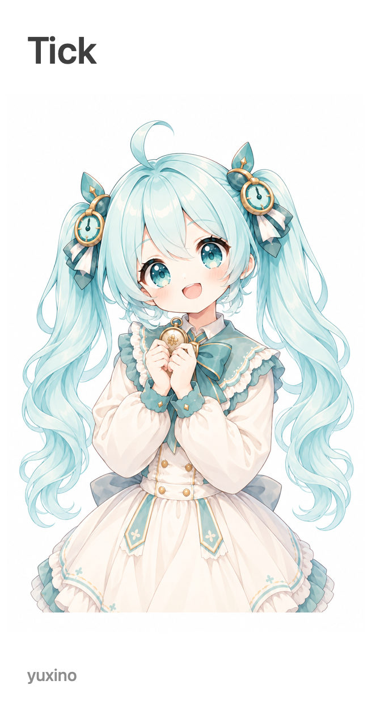
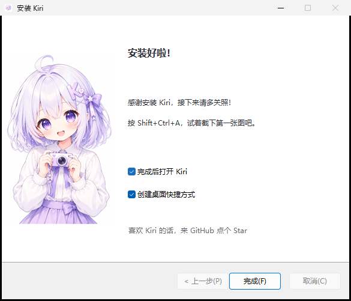

# Desktop Installer

[English](README.md)

为 **Tauri 2 + NSIS** 准备的公共 Windows 安装样式。
布局、翻译和立绘只维护一份，每个应用都有自己的半身妹妹、欢迎文案和可选的 GitHub 链接。

<table><tr>
<td align="center"><br>Kiri</td>
<td align="center"><br>Mimi</td>
<td align="center"><br>Satori</td>
<td align="center"><br>Viva</td>
<td align="center"><br>Tick</td>
<td align="center"><br>WNACG</td>
</tr></table>

上面是安装包实际使用的侧图。预览与原生安装界面共用位置规则，控件、字体和显示缩放由 Windows 负责。



*使用实际素材和文案的布局预览，不是 Windows 实机截图。*

- 每个应用独立的高清角色源图，输出无损 656 × 1256、24 位真彩侧图。
- 英语、简体中文和日语，覆盖欢迎、完成、维护和错误提示。
- 完成页感谢安装；GitHub / Star 链接仅在主动点击时打开。
- 固定版本、校验哈希、离线构建，应用侧只需 Node.js。
- 一条命令同步所有已登记应用，不用逐个修改模板。
- 安装、更新、卸载、快捷方式和 WebView2 继续使用 Tauri 原有流程。

## 试试看

需要 Node.js 22 或更新版本，无需安装 npm 依赖或配置生图服务。

```sh
git clone https://github.com/yuxino/desktop-installer.git
cd desktop-installer
npm test
npm run build
npm run preview
```

打开 `dist/preview.html`，可以切换应用、语言和欢迎 / 完成页面。
这是布局预览，不是 Windows 实机截图。

如果 PATH 中有 NSIS 3.11，运行 `npm run test:nsis` 可编译每个应用、每种语言的
预览程序；预览程序不会安装或启动真实应用。Windows CI 会实际打开全部 18 个原生预览，
检查下一步、上一步、完成和运行复选框，并截取欢迎、目录、完成页。
下载 Actions 的 `installer-previews-and-bundles` 产物，在 `windows-ui/` 中查看 PNG、
控件位置与文字，以及包含实际 DPI 和程序哈希的 `results.json`。
这些是 Windows 原生窗口截图；预览程序没有真实应用内容，实际应用安装、升级和设备缩放验收仍需单独验证。

## 接入自己的项目

Fork 或克隆仓库，添加自己的项目资料和立绘，再同步到 Tauri 应用：

```sh
node scripts/sync.mjs --project ../my-app --product my-app
```

[接入说明](docs/integration.md) 包含资料格式、立绘处理、自定义安装器、构建命令和升级方式。
名称、发布者和 GitHub 地址都可以替换，内置的六个应用是可参考的实例。

如果所有已登记应用都在同一个目录下：

```sh
npm run sync -- --root ../
npm run sync -- --root ../ --check
```

检查改动后，在各应用仓库提交生成的素材包和版本锁。公共仓库更新不会自动改变已有版本；
需要同步并构建下一版应用，新安装包才会采用新样式。

## 范围

这个项目负责 Windows NSIS 安装外观，不提供签名证书、不消除系统安全提示，
也不代替应用内的下载进度和更新功能。暂未包含 macOS DMG / PKG 外观。
详细取舍见[架构说明](docs/architecture.md)。

## 贡献与许可

见 [CONTRIBUTING.md](CONTRIBUTING.md)。代码、模板和内置立绘采用 [MIT 许可](LICENSE)。
立绘由 AI 参考各项目已有角色生成，记录见 [docs/artwork.md](docs/artwork.md)。
项目名称用于标识各自产品，使用本工具不代表获得这些项目的背书。
